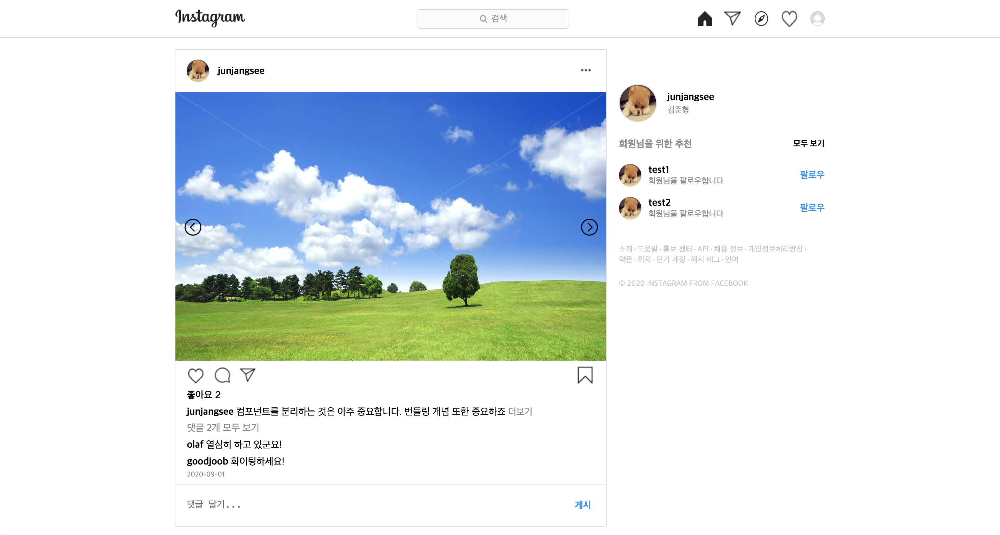
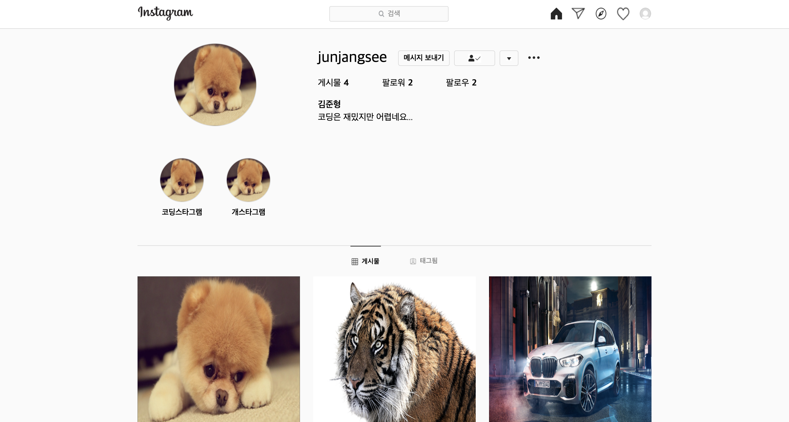
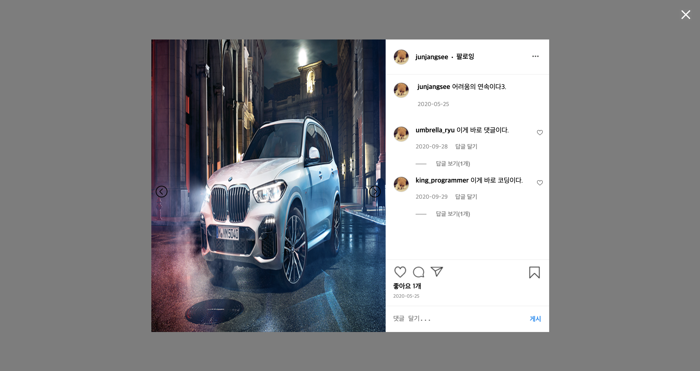

# 인스타그램 클론

인스타그램 메인 페이지, 프로필 페이지, 상세 페이지를 클론합니다.

## 기술 스택

- Language: HTML, CSS, Javascript
- Library: Browserify

## 설치

```text
$ git clone https://github.com/junjangsee/instagram-clone.git
$ cd instagram-clone
$ npm install
$ npm run build
```

## 실행

```text
build/index.html
```

## 프로젝트 구조

```text
.
+-- public (번들링할 파일 구성)
|   +-- index.html
|   +-- style.css
+-- src
|   +-- components (페이지를 구성하는 컴포넌트 구성)
|   |   +-- feed (게시글)
|   |   |   +-- *.js
|   |   +-- post (게시글 상세)
|   |   |   +-- *.js
|   |   +-- profile (프로필)
|   |   |   +-- *.js
|   |   +-- recommend (추천 목록)
|   |   |   +-- *.js
|   |   +-- shared (프로젝트 종속이 아니라 어디서든 쓸 수 있는 디자인 관련 컴포넌트 모음)
|   |   +-- *.js (공통으로 사용되는 컴포넌트)
|   +-- containers (페이지 내 데이터를 처리하는 컨테이너 모음)
|   |   +-- *.js
|   +-- images
|   +-- lib (직접 구현한 라이브러리 모음)
|   |   +-- *.js
|   +-- pages (라우팅 단위 페이지 구성)
|   +-- *.js
|   |   +-- mocks (프로젝트에 사용되는 데이터들 모음)
+-- index.js (최초 라우팅)
.
```

## 작업 페이지

### 메인



### 프로필



### 게시글



## 작업 내용

- [Issues](https://github.com/junjangsee/instagram-clone/issues?q=is%3Aissue+is%3Aclosed)
- [Pull Requests](https://github.com/junjangsee/instagram-clone/pulls?q=is%3Apr+is%3Aclosed)
